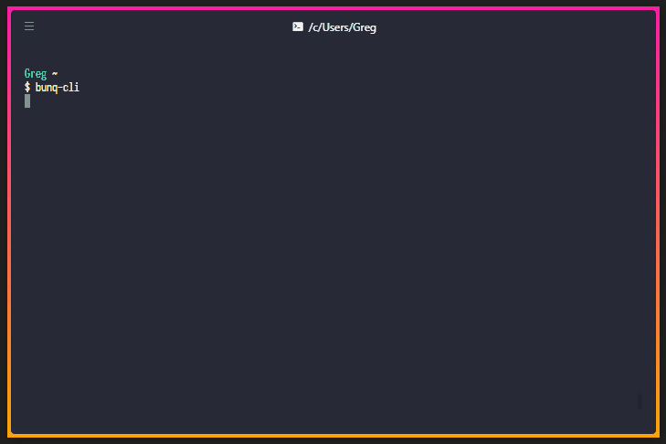

# bunq-cli

[ ](https://github.com/@bunq-community/bunq-cli)
[ ](https://www.npmjs.com/package/@bunq-community/bunq-cli)
[ ](https://travis-ci.org/bunqCommunity/bunq-cli)
[](https://github.com/bunqCommunity/bunq-cli/blob/master/LICENSE)

<!--[ ](https://codecov.io/gh/bunqCommunity/bunq-cli)-->

An unofficial and open source CLI tool to quickly test API requests with the bunq API.

Either test API requests interactively or use it directly in other command line tools and cronjobs.

<p align="center">
    
</p>
<p align="center"><i>Interactive mode example</i></p>

## Features

-   Create and add funds to sandbox accounts within seconds
-   Create a new monetary account from the command line
-   Send API requests and output to console or files as JSON

## Getting started

Install globally as a command `yarn global add @bunq-community/bunq-cli` or `npm install -g @bunq-community/bunq-cli`

Standard interactive mode while storing your keys at the default location:

```bash
bunq-cli --save
```

## Roadmap
 - Add a password option to allow for production API key storage
 - Turn commands and actions into a module-like system
 - Support for both regular API key and OAuth logins through QR codes.
 - View current user, monetary accounts and other API data in interactive mode.
 - Transfers between own accounts by ID and description for CLI mode and through the UI in interactive mode.
    - `bunq-cli --cli --transfer --transfer-from Shopping --transfer-to Savings --amount 10`
    - `bunq-cli --cli --transfer --transfer-from-id 1234 --transfer-to-id 4321 --amount='12.36' --description='Less shopping'`

## Options

bunq-cli will check for a .env in your working directory. Any environment variables starting with `BUNQ_CLI_` will be parsed as input options. Some examples of this are:

-   `BUNQ_CLI_API_KEY=some-key-value` instead of `--api-key`
-   `BUNQ_CLI_SAVE=false` instead of `--save=false`

Make sure to use `--help` to view the specific options you can use for each sub command

### Generic options

These are the most basic options that you'll need. If `--memory` is defined, the bunqJSClient will do everything in memory without writing data to a file. Subsequent API calls will be faster if you do not use this option since it won't have to setup a new API session with bunq the next time you use bunq-cli.

-   `--save`/`-s` Location to store the API session info, defaults to `$HOME/bunq-cli.json`. Use the --memory option to ignore stored data.
-   `--memory` Ignores the stored session info and does everything in memory, useful for testing sandbox scripts without removing the stored key.
-   `--overwrite` Overwrite the stored session info with the given options, by default this is false so parameters like `--api-key` are ignored if session info already exists.
-   `--output` How to output the API data. Choices are `file`/`f` for writing a new file to the output-location or `console`/`c` in CLI mode to output only the API data to the console.
-   `--output-location` Directory location if `--output` is set to file. Defaults to `$HOME/bunq-cli-api-data`.

-   `--apiKey`/`--apiKey` The bunq API key, creates a sandbox key by default
-   `--deviceName`/`--device-name` Device name to identify the API key
-   `--encryptionKey`/`--encryption-key` Encryption key for bunqJSClient, generates a random key by default
-   `--environment` bunq API environment to use

### Optional parameters

-   `--method` API method to use, defaults to "LIST".
-   `--data` A string with JSON which is the data that well be sent in POST/PUT requests.
-   `--count`, `--older-id` and `--newer-id` for filtering LIST requests like described in the bunq docs.
-   `--account` To define which MonetaryAccount should be used by account description.
-   `--accountId`/`--account-id` To define which MonetaryAccount should be used by account ID.
-   `--account` To define which MonetaryAccount should be used by account description.
-   `--eventId`/`--event-id` To define which object should be fetched, required for most GET endpoints.
-   `--pretty` Whether to prettify the JSON output or not. You can give it a string to use as spacer, defaults to 2 spaces, use '\t' to format with tabs for example
-   `--clean` Will attempt to cleanup some of the wrappers for the bunq API. For example Arrays with a single value or the Response object.

## Sub commands

By default the `--output` mode is set to `console` when using sub commands.

### Basic commands

-   `bunq-cli user` Fetches the User info.
-   `bunq-cli accounts` Fetches all monetary accounts for the current User.
-   `bunq-cli events` Fetches all events using the `/user/{userId}/event` endpoint.
-   `bunq-cli create-key` Creates a new Sandbox environment API key and outputs it.

## Advanced commands

These commands require more knowledge of the API but supply a few useful ways to make using the correct endpoints and accounts easier.

-   `bunq-cli endpoint <endpoint-name>` A specific endpoint you want to call. Only a few basic LIST and GET endpoints are supported by this, run it without a value to view the list of supported shorthand endpoints
-   `bunq-cli url <url>` A specific URL you wish to call. This is the more advanced option compared to endpoint since you have to define the entire URL yourself.
    Some helpers when using this command are the following:

Using `UserID` in the url will automatically be replaced by the current user's ID. For example `/user/UserID` becomes `/user/1234`.

Next you can use `Account=<account description>` to reference a specific account. `Account=<description>` Will be replaced by the first account who's description matches the value. If you have a account named 'Shopping' with id 15 and your user ID is 1234 the following url: `/user/UserID/monetary-account/Account=Shopping/payment` will turn into `/user/1234/monetary-account/15/payment`.

## Contact

[ ](https://together.bunq.com/d/6180-bunq-cli-a-new-unofficial-command-line-tool-for-the-bunq-api/11) [ ](https://t.me/bunqcommunity)

We have a public [Telegram chat group](https://t.me/bunqcommunity) and a topic on [bunq together](https://together.bunq.com/d/5763-bunqdesktop-the-unofficial-free-and-open-source-desktop-application-for-bunq/).

Feel free to create a new issue for any suggestions, bugs or general ideas you have on Github or contact us through one of the above.

## Contributors 

[](https://sourcerer.io/fame/crecket/bunqCommunity/bunq-cli/links/0)[](https://sourcerer.io/fame/crecket/bunqCommunity/bunq-cli/links/1)[](https://sourcerer.io/fame/crecket/bunqCommunity/bunq-cli/links/2)[](https://sourcerer.io/fame/crecket/bunqCommunity/bunq-cli/links/3)[](https://sourcerer.io/fame/crecket/bunqCommunity/bunq-cli/links/4)[](https://sourcerer.io/fame/crecket/bunqCommunity/bunq-cli/links/5)[](https://sourcerer.io/fame/crecket/bunqCommunity/bunq-cli/links/6)[](https://sourcerer.io/fame/crecket/bunqCommunity/bunq-cli/links/7)
