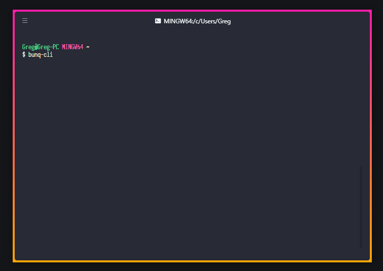

# bunq-cli
[](https://github.com/@bunq-community/bunq-cli) [](https://www.npmjs.com/package/@bunq-community/bunq-cli)

An unofficial and open source CLI tool to quickly test API requests with the bunq API.

Either test API requests interactively or use it directly in other command line tools and cronjobs.

<p align="center">
    
</p>
<p align="center"><i>Interactive mode example</i></p>

## Features

 - Create and add funds to sandbox accounts within seconds
 - Create a new monetary account from the command line
 - Send API requests and output to console or files as JSON

## Getting started
Install globally as a command `yarn global add @bunq-community/bunq-cli` or `npm install -g @bunq-community/bunq-cli`

Standard interactive mode while storing your keys at the default location:
```bash
bunq-cli
```

## Roadmap
 - Create sandbox accounts with `--sandbox-account`.
 - Support for both regular API key and OAuth logins through QR codes.
 - View current user, monetary accounts and other API data in interactive mode.
 - Transfers between own accounts by ID and description for CLI mode and through the UI in interactive mode.
    - `bunq-cli --cli --transfer --transfer-from Shopping --transfer-to Savings --amount 10`
    - `bunq-cli --cli --transfer --transfer-from-id 1234 --transfer-to-id 4321 --amount='12.36' --description='Less shopping'`

## Options
bunq-cli will check for a .env in your working directory. Any environment variables starting with `BUNQ_CLI_` will be parsed as input parameters. Some examples of this are:

  - `BUNQ_CLI_API_KEY=some-key-value` instead of `--api-key`
  - `BUNQ_CLI_SAVE=true` instead of `--save`

### Generic options
These are the most basic options that you'll need. If `--save` or `-s` isn't defined, bunqJSClient will do everything in memory without writing data to a file. Subsequent API calls will be faster if you do use this option since it won't have to setup a new API session with bunq.

 - `--save`/`-s` Store the bunqJSClient data, enabling this will significantly speed up future calls. If used but empty, it will use `$HOME/bunq-cli.json`.
 - `--output` How to output the API data. Choices are `file`/`f` for writing a new file to the output-location or `console`/`c` in CLI mode to output only the API data to the console.
 - `--output-location` Directory location if `--output` is set to file. Defaults to `$HOME/bunq-cli-api-data`

### CLI mode
For scripts/quick data fetching use the `--cli` option which makes sure that bunq-cli won't start in interactive mode. By default the `--output` mode is set to `console` in CLI mode.

### CLI mode  commands
Only one of these can be use

 - `--user` fetches the User object.
 - `--accounts` fetches all monetary accounts for the current User object.
 - `--events` fetches all events using the `/user/{userId}/event` endpoint.
 - `--endpoint` a specific endpoint you want to call. Only a few basic LIST and GET endpoints are supported by this, run it without a value to view the list of supported shorthand endpoints
 - `--url` a specific URL you wish to call.
 
### Optional parameters 

 - `--method` defaults to "LIST"
 - `--data` a string with JSON which is the data that well be sent in POST/PUT requests
 - `--count`, `--older-id` and `--newer-id` for filtering LIST requests like described in the bunq docs
 - `--account` to define which MonetaryAccount should be used by account description
 - `--account-id` to define which MonetaryAccount should be used by account ID
 - `--event-id` to define which object should be fetched, required for most GET endpoints.
 - `--pretty` Whether to prettify the JSON output or not. You can give it a string to use as spacer, defaults to 2 spaces, use '\t' to format with tabs for example
